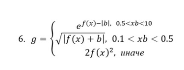
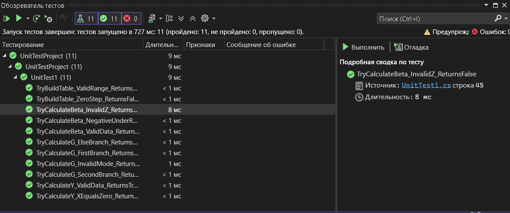

# Практическая работа №6  
## Рефакторинг и модульное тестирование WPF-приложения

### Выполнили: Арутюнов, Старшинов

---

## Описание работы

В данной практической работе был выполнен рефакторинг WPF-приложения, созданного в практической работе №4, и разработаны модульные тесты для проверки корректности вычислений математических функций.

---

## Реализованные формулы

### Страница 1

Функция:

Проверки:
- `z` должен принадлежать диапазону `[-1; 1]`;
- подкоренное выражение не должно быть отрицательным;
- для корректного вычисления степени используется условие `x >= 0`.

---

### Страница 2

Кусочная функция:

где функция `f(x)` выбирается пользователем:
- `sh(x)`
- `x²`
- `e^x`

---

### Страница 3

Функция:

Проверки:
- `x ≠ 0`;
- `tan(...)` должен быть определён.

---

## Выполненный рефакторинг

В ходе выполнения работы вычислительная логика была вынесена из обработчиков кнопок `Calc_Click` в отдельный класс `AllFormuls`.

Это позволило:
- сократить код страниц;
- отделить интерфейс от вычислений;
- упростить поиск ошибок;
- сделать функции доступными для модульного тестирования.

Обработчики кнопок теперь выполняют только:
1. чтение данных из полей ввода;
2. вызов методов вычисления;
3. вывод результата или сообщения об ошибке.

---

## Основные методы класса `AllFormuls`

- `CubeRoot(double x)` — вычисление кубического корня;
- `TryCalculateBeta(...)` — вычисление функции β;
- `CalculateFx(double x, int mode)` — вычисление вспомогательной функции `f(x)`;
- `TryCalculateG(...)` — вычисление кусочной функции `g`;
- `TryCalculateY(...)` — вычисление функции `y`;
- `TryBuildTable(...)` — построение таблицы значений для функции `y`.

---

## Модульное тестирование

Для проверки работы программы был создан отдельный проект `UnitTestProject`, содержащий тесты для всех реализованных функций.

### Проверяемые случаи:
- корректное вычисление функции β;
- ошибка при недопустимом значении `z`;
- ошибка при отрицательном подкоренном выражении;
- проверка всех трёх ветвей кусочной функции `g`;
- корректное вычисление функции `y`;
- ошибка при `x = 0`;
- успешное построение таблицы значений;
- ошибка при `dx = 0`.

---

## Результат работы

В результате выполнения практической работы:
- приложение было переработано и улучшено;
- вычислительная логика была вынесена в отдельный класс;
- написаны модульные тесты;
- проверена корректность вычислений;
- код снабжён XML-комментариями.

---

## Вывод

В ходе практической работы был изучен процесс рефакторинга существующего приложения и разработки модульных тестов.  
Вынесение математических вычислений в отдельный класс позволило отделить бизнес-логику от пользовательского интерфейса и сделать код более удобным для сопровождения и тестирования.  
С помощью модульных тестов была подтверждена корректность вычислений функций, а также обработка ошибочных ситуаций.  

### Тесты
 Все тесты были корректно выполнены и программа работает отлично

