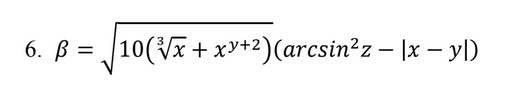
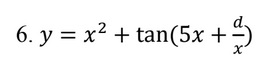

# WPF Практическая работа №4 — Вариант 6


# 👨‍💻 Автор

Практическая работа №4
Вариант 6
Авторы: Арутюнов, Старшинов

---

##  Описание проекта

Данное приложение разработано на платформе **WPF (Windows Presentation Foundation)** в рамках практической работы №4.

Программа реализует:

* Вычисление математических выражений
* Обработку условных операторов
* Работу с циклами
* Построение графика функции
* Навигацию между страницами
* Визуализацию формул через изображения

---

#  Цель работы

* Закрепить навыки работы с WPF
* Реализовать многостраничное приложение
* Освоить обработку пользовательского ввода
* Реализовать построение графика функции
* Научиться работать с Git

---
##  Структура проекта

```
wpfPr4
│
├── MainWindow.xaml        → Главное окно + навигация
├── Pages/
│   ├── Page1.xaml         → Формула №1
│   ├── Page2.xaml         → Кусочная функция
│   └── Page3.xaml         → Таблица значений + график
│
├── Photo/                 → Изображения формул
└── README.md
```
---

#  Функциональность страниц

## Страница 1

Вычисление выражения:



Реализовано:

* Проверка области допустимых значений
* Обработка ошибок ввода

---

##  Страница 2

Кусочная функция:


Где пользователь выбирает:

* sh(x)
* x²
* eˣ

Реализовано:

* RadioButton выбор функции
* Условные операторы
* Обработка граничных условий

---

## 📘 Страница 3 (Основная часть)

Функция варианта 6:



Реализовано:

* Циклический расчёт значений (for)
* Защита от:

  * x = 0
  * разрывов tan()
  * бесконечностей
* Вывод таблицы значений
* Автоматический масштаб
* Разрыв графика в точках асимптот

---

#  Построение графика

График строится вручную:

* Используется `Canvas`
* Реализовано масштабирование координат
* Добавлены оси X и Y
* Обрабатываются разрывы функции
* Рисование выполняется через `Polyline`

---


#  Пример входных данных для страницы 3

```
x0 = 1
xk = 10
dx = 0.05
d  = 2
```

⚠ Через 0 строить нельзя (есть d/x)

---

#  Обработка ошибок

В проекте реализована защита от:

* Деления на 0
* Выхода за ОДЗ
* Переполнения tan()
* Некорректного ввода
* Слишком большого количества точек

---

